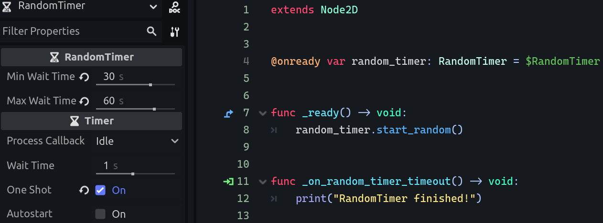

# ⌛ RandomTimer for [Godot Engine](https://godotengine.org/) 4.x.

**RandomTimer** is an addon that allows you to create a node based on Godot's built-in **Timer**, letting you randomize the wait time through the min/max values in the `Inspector` tab.

## 🛠️ Installation

1. Download the [**RandomTimer**](https://gitlab.com/Dritic/randomtimer/-/archive/main/randomtimer-main.zip) addon.
2. Extract the `random_timer` folder into the `addons` folder within your Godot project directory.
3. Enable the addon in Godot's plugins tab. (`Project > Project Settings > Plugins`)

## 📖 Usage

- Add the **RandomTimer** node to your scene(s) like any regular node in Godot.
- Adjust the min/max wait time values to your liking through the `Inspector` tab.
- Start the **RandomTimer** by calling the **$RandomTimer.start_random()** function **OR** by enabling autostart in the `Inspector` tab.

## 💖 Credits

- [**Timer**](https://github.com/godotengine/godot/blob/master/editor/icons/Timer.svg) icon from [**Godot Engine**](https://godotengine.org/).